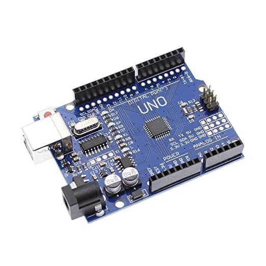
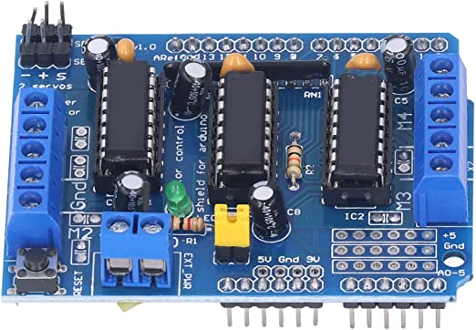
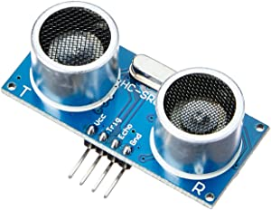
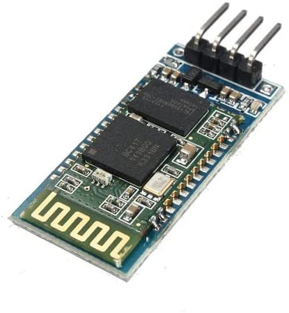
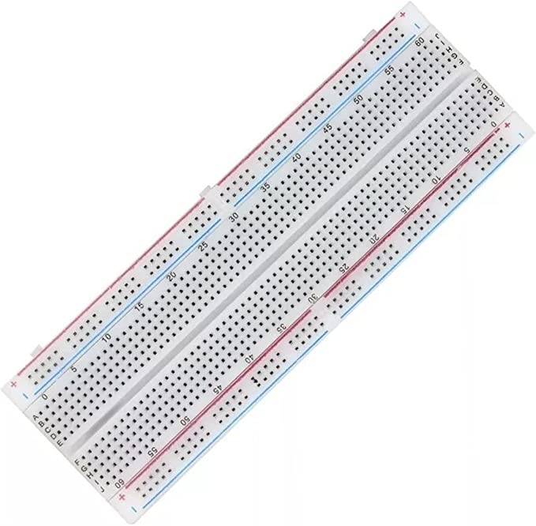
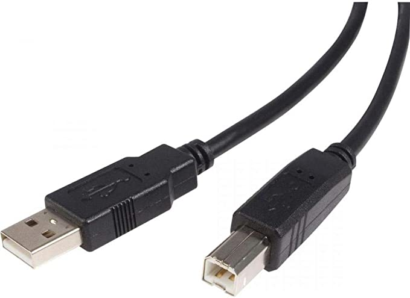
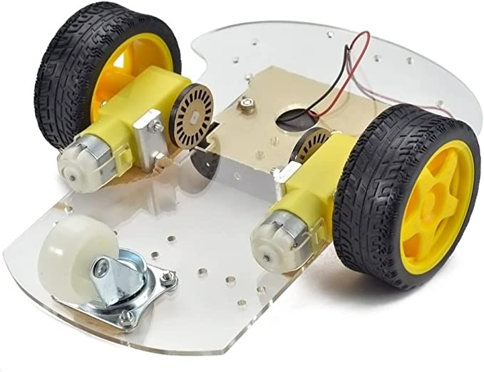

# Construindo um Robô Arduino - Parte I

Construindo um veículo robô controlado remotamente.

Usando Arduino para a plataforma de hardware, por ser amplamente utilizada por criadores de hardware em todo o mundo, o que significa que há muitas informações e recursos disponíveis.

Sendo fácil o suficiente para concluir em um período de tempo relativamente curto, mas difícil o suficiente para ser interessante e desafiador.

<!--more-->


Este artigo é uma tradução vergonhosa da página do [miguelgrinberg.com](https://blog.miguelgrinberg.com/post/building-an-arduino-robot-part-i-hardware-components).


## Recursos e Funções do Robô

Recursos e funções:
- Deve ser um veículo que pode se mover para frente, para trás e virar.
- Deve ser fácil de montar e desmontar.
- Deve ter um modo em que seja capaz de se mover por conta própria, detectando os obstáculos à frente e evitando-os.
- Deve ter um modo em que possa ser totalmente controlado a partir do meu smartphone Android.
- Deve ser fácil de hackear, mudar e melhorar.

## Lista de Dispositivos

Lista de dispositivos usados para projeto:
- Placa Arduino
- Controle de motor
- Sensor de distância
- Escravo Bluetooth
- Placa de prototipagem e cabos
- Cabo USB
- Kit de veículo

### Placa Arduino

Arduino é uma plataforma eletrônica de código aberto baseada em hardware e software fáceis de usar. As placas Arduino são capazes de ler entradas de um sensor, transformá-las em uma saída, ativando um motor, ligando um LED ou até publicando algo online. Você pode dizer à sua placa o que fazer enviando um conjunto de instruções para o microcontrolador na placa. Para isso utiliza-se a linguagem de programação Arduino (baseada em Wiring), e o Software Arduino (IDE), baseado em Processamento.

### Controle de Motor

A placa Arduino não pode controlar diretamente um motor. Para essa função existe um circuito especializado chamado `H-Bridge`, e existem várias implementações deste circuito prontamente disponíveis para a plataforma Arduino, ou você também pode construir um a partir de peças básicas por quase nada.

### Sensor de Distância

Os sensores de distância enviam um sinal ultrassônico para a frente e, em seguida, aguardam para receber um sinal rebatido. Dependendo de quanto tempo o sinal leva para retornar, a distância aproximada de um obstáculo pode ser calculada. Vamos usar este pequeno dispositivo para evitar que o robô bata em paredes ou outros obstáculos em seu caminho.

### Escravo Bluetooth

A maneira mais fácil de controlar o robô a partir de um smartphone é através da interface serial bluetooth que todos os smartphones modernos possuem. O telefone funcionará como um mestre, então eu precisava de um escravo bluetooth para o robô.

### Placa de prototipagem (protoboard) e cabos

Para poder montar e desmontar o robô à vontade sem estragar nenhuma peça, usaremos uma  placa de prototipagem (protoboard) e diversos cabos não havendo necessidade de nenhuma solda.

### Cabo USB

A placa Arduino é conectada a um computador através de uma porta USB. A conexão USB é usada para carregar software e também pode ser usada como fonte de energia durante o teste.

### Kit de Veículo para Arduino

Existem muitas opções de kit para veículos com Arduino. Os únicos requisitos é um com o tamanho suficiente para suportar a plataforma e todas as peças, incluindo as rodas e motores.

## Ilustrações

**PIXABAY**  
Disponível em: <https://pixabay.com/pt/photos/circuito-integrado-computador-441294/>  
Acesso em: 17 abr. 2023.

**AMAZON.COM.BR - PLACA ARDUINO**  
Disponível em: <https://www.amazon.com.br/Placa-Uno-Atmega328p-compat%C3%ADvel-Arduino/dp/B0BSSLRM7L/ref=sr_1_3?keywords=arduino&qid=1681826246&sr=8-3>  
Acesso em: 17 abr. 2023.

**AMAZON.COM.BR - CONTROLE DE MOTOR**  
Disponível em: <https://www.amazon.com.br/controlador-unidade-expans%C3%A3o-compat%C3%ADvel-Duemilanove/dp/B09ZQP1B46/ref=sr_1_15?__mk_pt_BR=%C3%85M%C3%85%C5%BD%C3%95%C3%91&crid=KT5LP178ZN7M&keywords=driver+motor&qid=1681826595&sprefix=driver+motor%2Caps%2C188&sr=8-15>  
Acesso em: 17 abr. 2023.

**AMAZON.COM.BR - SENSOR DE DISTÂNCIA**  
Disponível em: <https://www.amazon.com.br/Modulo-Distancia-Ultrass%C3%B3nico-Chipsce-Hc-Sr04/dp/B08L7RLY5T/ref=sr_1_1?__mk_pt_BR=%C3%85M%C3%85%C5%BD%C3%95%C3%91&crid=1VLOUPOQBT93V&keywords=Hc-Sr04&qid=1681826497&sprefix=hc-sr04%2Caps%2C176&sr=8-1>  
Acesso em: 17 abr. 2023.

**AMAZON.COM.BR - ESCRAVO BLUETOOTH**  
Disponível em: <https://www.amazon.com.br/M%C3%B3dulo-Bluetooth-Hc-06-Slave-Rs232/dp/B09Q8H8W9X/ref=sr_1_2?__mk_pt_BR=%C3%85M%C3%85%C5%BD%C3%95%C3%91&crid=WCKJ46B48730&keywords=HC-06&qid=1681826898&sprefix=hc-06%2Caps%2C173&sr=8-2>  
Acesso em: 17 abr. 2023.

**AMAZON.COM.BR - PROTOBOARD**  
Disponível em: <https://www.amazon.com.br/Protoboard-Regulador-Tens%C3%A3o-Jumper-Fios/dp/B0BY5KT69Z/ref=sr_1_1?__mk_pt_BR=%C3%85M%C3%85%C5%BD%C3%95%C3%91&crid=28DFD87NBZ5JP&keywords=protoboard&qid=1681827372&sprefix=protoboard%2Caps%2C436&sr=8-1>

**AMAZON.COM.BR - CABO USB**  
Disponível em: <https://www.amazon.com.br/Cabo-Para-Impressora-Pluscable-1-8M/dp/B076B5M45B/ref=sr_1_25?keywords=cabo+usb&qid=1681826419&sr=8-25>  
Acesso em: 17 abr. 2023.

**AMAZON.COM.BR - KIT DE VEÍCULO**  
Disponível em: <https://www.amazon.com.br/Chassi-Carro-Segue-Faixa-Rodas/dp/B0BY5K14K7/ref=sr_1_7?__mk_pt_BR=%C3%85M%C3%85%C5%BD%C3%95%C3%91&crid=S5AE51KK8X2D&keywords=kit+de+veiculo+arduino&qid=1681827433&sprefix=kit+de+veiculo+arduino%2Caps%2C188&sr=8-7>  
Acesso em: 17 abr. 2023.

## Fontes

**MIGUELGRINBERG.COM**  
Disponível em: <https://blog.miguelgrinberg.com/post/building-an-arduino-robot-part-i-hardware-components>  
Acesso em: 17 abr. 2023.

**ARDUINO.CC**  
Disponível em: <https://www.arduino.cc>  
Acesso em: 17 abr. 2023. 
