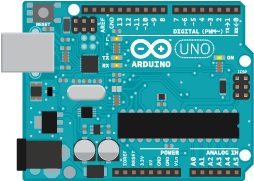
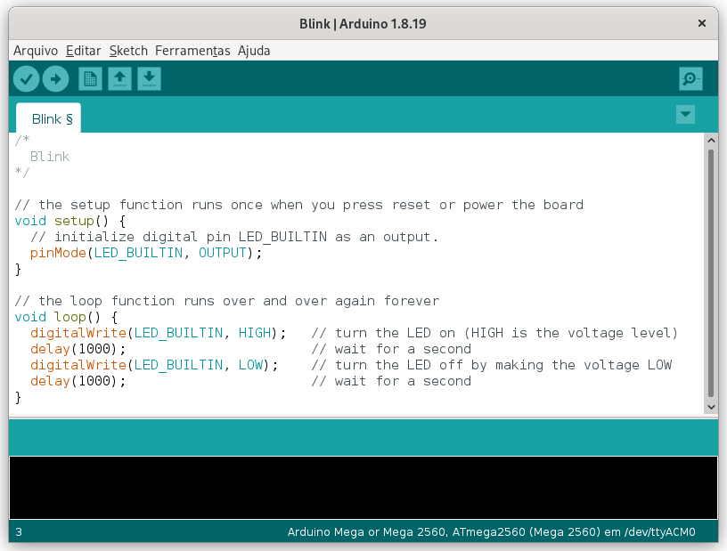
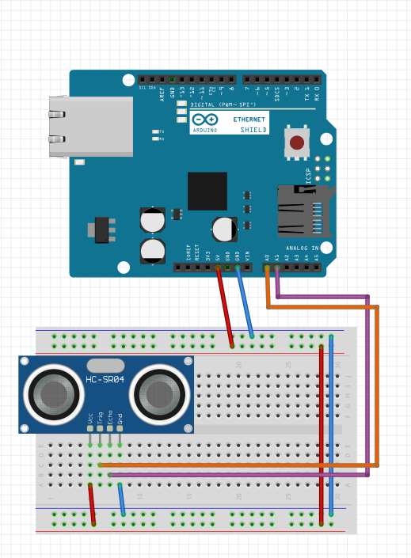
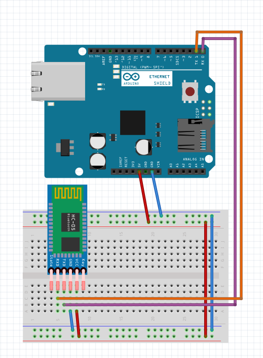

# Construindo um Robô Arduino - Parte II


Programando o Arduino

Você conhecerá os fundamentos da programação de sensores, motores e outros dispositivos conectados ao Arduino, e também terá um entendimento de como um controle remoto sem fio pode se comunicar com a placa Arduino via Bluetooth.

<!--more-->


Este artigo é uma tradução vergonhosa da página do [miguelgrinberg.com](https://blog.miguelgrinberg.com/post/building-an-arduino-robot-part-ii-programming-the-arduino).


## Os pinos do Arduino

A placa Arduino se comunica com os dispositivos conectados por meio de seus pinos de entrada e saída:



No lado esquerdo você tem a porta USB (caixa cinza) e o conector de entrada de energia (caixa preta). Durante o teste, alimentaremos o Arduino com um cabo USB, mas o robô final receberá energia de uma caixa de bateria conectada ao conector de entrada de energia.

No topo, da direita para a esquerda, há 14 pinos marcados do `0` ao `13`. Estes são os `pinos digitais`. Esses pinos podem ser configurados individualmente como entradas ou saídas, o que significa que dados digitais podem ser lidos ou gravados de dispositivos conectados nesses pinos. Como esses pinos são digitais, eles têm apenas dois estados possíveis, `HIGH` e `LOW`.

Alguns dos pinos digitais possuem funções pré-atribuídas. Os pinos `0` e `1` também são rotulados `RX` e `TX` respectivamente. Estes são usados ​​pelo hardware de comunicação serial para enviar e receber dados. O pino `13` tem um `LED` ligado a ele na maioria das placas Arduino, por isso é um pino conveniente para enviar informações visuais simples para o mundo real. O LED do pino 13 está localizado abaixo do próprio pino 13, identificado com a letra `L` no diagrama acima. Os pinos `3`, `5`, `6`, `9`, `10` e `11` são marcados com um `~` ou uma etiqueta `PWM`, abreviação de `Pulse Width Modulation` (Modulação por Largura de Pulso). Esses pinos são capazes de produzir uma saída analógica simulada em uma linha digital. Estes podem ser usados, por exemplo, para acender um LED em diferentes níveis de intensidade.

O próximo pino no topo da direita para a esquerda é `GND`, abreviação de `ground` (terra). O terra é o que fecha um circuito e permite que a corrente elétrica flua ininterruptamente.

O próximo pino no canto superior esquerdo é rotulado `AREF`, abreviação de `Analog Reference` (Referência Analógica). Este pino raramente é usado, ele informa ao Arduino como configurar a faixa de tensão dos pinos analógicos.

No canto inferior direito, temos seis pinos rotulados com `0` até `5`. Estes são os `pinos de entrada analógica`. Ao contrário dos pinos digitais que possuem apenas dois estados possíveis, um pino analógico pode ter `1024 estados possíveis`, de acordo com a tensão aplicada a ele. Normalmente, a faixa de tensão vai até `5V`, mas a faixa pode ser alterada aplicando a tensão máxima desejada ao pino `AREF`. Também diferente dos pinos digitais que podem ser configurados como entradas ou saídas, os pinos analógicos podem ser apenas entradas.

Uma propriedade interessante dos `pinos analógicos` é que eles também podem ser usados ​​como `pinos digitais`, com `números de pinos de 14 a 19`. Você verá mais tarde que uma parte importante de qualquer projeto é alocar pinos para componentes. Se você está ficando sem pinos digitais, lembre-se de que você tem mais seis disponíveis para você.

Continuando na parte inferior da direita para a esquerda, encontramos um alfinete rotulado `VIN`. Este pino fornece acesso direto à `tensão fornecida pela fonte de alimentação`. Por exemplo, se você alimentar seu Arduino com uma fonte de alimentação de 9V através do conector de alimentação, esse pino fornecerá 9V.

Os próximos dois pinos são rotulados `GND` são mais dois pinos de aterramento, exatamente como o da linha superior. Eles estão aqui apenas por conveniência.

Os próximos dois pinos são rotulados `5V` e `3.3V` apenas retornam essas tensões, independentemente de qual seja a tensão da fonte de alimentação.

Em seguida, temos o pino `RESET`. Quando este pino é conectado ao `GND` do placa, ele é redefinido. Portanto, este é um pino útil para construir um botão de reinicialização externo.

Se você estiver interessado em descobrir o que os pinos extras em sua placa fazem, consulte a documentação de sua placa.

## Programando o Arduino com Sketches

A maneira mais fácil de programar a placa é com o [**Software Arduino**](https://www.arduino.cc/en/software), que é gratuito e de código aberto, disponível para usuários de Windows, Mac OS X e Linux.

Aqui está uma captura de tela do software Arduino:



A área branca é onde o programa é escrito. A linguagem de programação que a plataforma Arduino utiliza chama-se `C++` (pronuncia-se C plus plus ), uma linguagem considerada muito poderosa, mas difícil de aprender.

Os programas `C++` são escritos como texto normal. O Arduino chama esses programas de `Sketches`. Em seguida, um utilitário chamado `compilador` lê o esboço e o converte em `instruções de máquina` que o Arduino entende.

A área preta na parte inferior da janela do software Arduino é onde as informações de status aparecem. Por exemplo, se o seu código `C++` tiver um erro, é aqui que você verá os detalhes.

O `Software Arduino` também possui uma barra de ferramentas, com os seguintes botões (em ordem, da esquerda para a direita):
- **Verificar**: executa o compilador C++ em seu programa. Se houver algum erro, você os verá na área preta de status.
- **Upload**: Compila seu programa C++ como o botão Verify faz, e se a compilação for bem-sucedida, ele carrega o programa resultante para a placa Arduino, que deve ser conectada ao computador através da porta USB.
- **Novo**: Limpa o programa atualmente carregado.
- **Abrir**: mostra uma lista suspensa com uma longa lista de programas de exemplo para carregar ou a opção de carregar um esboço do disco.
- **Salvar**: Salva o programa atual em um arquivo no disco.
- **Serial Monitor**: Abre o console do monitor serial. Isso é usado principalmente para depuração, como mostrarei daqui a pouco.

## "Olá, mundo!", estilo Arduino

Para começar, vamos escrever um programa muito simples que escreve uma mensagem na porta serial. Veremos esta mensagem no Serial Monitor.

Primeiro instale o [**Software Arduino**](https://www.arduino.cc/en/software). As instruções de instalação são muito simples, você não deve ter nenhum problema com esta etapa.

Inicie o software Arduino certificando-se de que a placa Arduino não esteja conectada ao seu computador. Abra o menu `Ferramentas` e, em seguida, o submenu `Porta`. Observe as opções que aparecem e feche o software Arduino.

Em seguida, conecte sua placa Arduino ao computador usando o cabo USB. Com a placa Arduino conectada, inicie o software Arduino novamente. No menu `Ferramentas`, abra o submenu `Placa` e verifique se o modelo correto da placa Arduino está selecionado. Em seguida, no submenu `Porta`, encontre a entrada da porta serial que não apareceu na lista quando você desconectou a placa Arduino. Essa é a porta serial atribuída à conexão do Arduino, então selecione-a.

Em seguida, na área branca, digite (ou copie/cole) o seguinte programa C++:

```cpp
void setup()
{
    Serial.begin(9600);
}

void loop()
{
    Serial.println("Olá, mundo!");
    delay(1000);
}
```

Pressione o botão `Carregar` para compilar e carregar o esboço no Arduino. Se você cometeu algum erro, ele será indicado na área preta de status. Neste ponto, os erros parecerão muito enigmáticos se você não estiver acostumado a programar em C++, então o melhor que você pode fazer é comparar o que você digitou com o acima e corrigir quaisquer diferenças que encontrar até que a operação de upload seja bem-sucedida.

Se o upload for bem-sucedido, a área de status exibirá uma mensagem semelhante à seguinte:

```
Binary sketch size: 1,978 bytes (of a 32,256 byte maximum)
```

Neste ponto, o programa está sendo executado dentro do Arduino. Você notará que o LED rotulado como `TX` pisca de vez em quando, indicando que a placa Arduino está transmitindo dados pela `porta serial`.

Para ver os dados, clique no botão `Monitor Serial` na barra de ferramentas. No canto inferior direito da janela do monitor serial, verifique se o menu suspenso está definido como `9600 baud`. Agora você deve ver a mensagem `Olá, mundo!` sendo impressa na janela a cada segundo.

Parabéns, você concluiu seu primeiro esboço do Arduino!

### Algumas informações

Os esboços do Arduino têm duas funções principais, chamadas `setup` e `loop`. Quando o programa iniciar, ele executará a função `setup`. Esta função deve inicializar o hardware e deixá-lo pronto para operação. Então a função `loop` será chamada repetidamente até que o Arduino seja resetado ou desligado. Se você observar o código acima, verá essas duas funções, cada uma começando com a palavra `void` seguida pelo nome da função e terminando com uma `chave` de fechamento.

O que vem antes da chave de abertura é chamado de `declaração da função`. O que vai entre as chaves de abertura e fechamento é o `código real da função`, ou seja, as instruções que o Arduino executa quando a função é invocada .

Neste pequeno exemplo, a função `setup` inicializa a interface serial chamando a função `Serial.begin`. O que vai entre os parênteses são chamados de `argumentos` e cada função define quais argumentos ela precisa, se houver. A função `Serial.begin` requer que a `velocidade da comunicação serial` seja fornecida como argumento, em unidades de `baud`. No exemplo foi selecionado `9600 bauds`. A instrução termina com um `ponto e vírgula`, que funciona como um `separador de instrução`.

### Referência do Arduino

Esta página de [**referência do Arduino**](https://www.arduino.cc/reference/en/) contém uma referência rápida para C++ e a lista de todas as funções fornecidas pelo ambiente de desenvolvimento do Arduino.

Por exemplo, digamos que você queira conhecer `todas as funções relacionadas às comunicações da porta serial`. Em seguida, você pode abrir o link `Serial` na seção `Communications`. Você encontrará a função `begin` usada acima. Observe que fora de qualquer contexto a função é chamada `Serial.begin`, mas quando o contexto está claramente na classe `Serial`, basta chamar a função `begin`. Se agora você quiser ver informações sobre os `argumentos` exigidos pela função `Serial.begin`, basta clicar nele para ir para a documentação do `Serial.begin`.

A documentação de referência do Arduino é muito boa, então eu recomendo que você a mantenha aberta em uma janela do navegador sempre que estiver escrevendo esboços.

A segunda função é a função `loop`. Esta função faz duas chamadas de função. Primeiro ele chama `Serial.println`, passando a mensagem `"Olá, mundo!"` como um argumento. Como você pode imaginar, a função `Serial.println` imprime uma mensagem na porta serial. A mensagem é fornecida como uma cadeia de caracteres , entre aspas duplas. A função é chamada de `println` e não `print` porque além de imprimir nossa mensagem ela finaliza a linha, fazendo com que a próxima impressão comece no início da próxima linha. Existe, de fato, uma dunção `print` que imprime a mensagem e não passa para a próxima linha.

A segunda e última instrução na função `loop` é uma chamada para uma função chamada `delay`. Esta função pausa o programa pelo tempo especificado como um argumento. As unidades de tempo são dadas em `milissegundos`, então passando o valor 1000 para pausar o programa por um segundo.

Como a função `loop` é invocada repetidamente, o resultado desse programa é que o texto `Olá, mundo!` é impresso no `Monitor Serial` a cada segundo.

## Trabalhando com LEDs

Vejamos seguinte esboço:

```cpp
void setup() {
    Serial.begin(9600);
    pinMode(13, OUTPUT);
}

void loop() {
    Serial.println("Hello, world!");
    digitalWrite(13, HIGH);
    delay(500);
    digitalWrite(13, LOW);
    delay(500);
}
```

Digite o código acima na janela de código do software Arduino substituindo o sketch antigo e faça o upload para sua placa para testá-lo.

Se você entendeu o primeiro esboço, provavelmente poderá descobrir o que esta versão faz facilmente.

Na função `setup`, além de inicializar a porta serial como antes, também esta inicializando o `pino 13` como um `pino de saída`. Lembre-se que os pinos digitais podem ser usados ​​como `entradas` ou `saídas`, então sempre que você precisar usar um pino, você deve configurá-lo para o uso pretendido. Nesse caso, estou tornando-o um pino de saída, o que significa que posso escrever um valor nesse pino, e o valor que escrevo afetará a corrente elétrica que sai dele. Consulte a documentação [**pinMode**](https://www.arduino.cc/reference/en/language/functions/digital-io/pinmode/) para obter detalhes sobre isso.

A função `loop` imprime a mensagem para a porta serial como antes, mas então define o `pino 13` para um estado `HIGH` com a função `digitalWrite`. Na maioria das placas Arduino, isso acende o LED on-board. Em seguida, o programa faz uma pausa de 500 milissegundos ou meio segundo. Em seguida, o estado do `pino 13` é alterado para estado `LOW` para desligar o LED. Então o programa dorme por mais meio segundo.

A função `loop` é chamada repetidamente, então o que o código acima faz é fazer o LED piscar! Ele pisca a uma taxa de uma piscada por segundo, permanecendo aceso no primeiro meio segundo e depois desligado na outra metade.

## Programação do sensor de distância

Programar o sensor de distância HC-SR04. Esse sensor ajuda o robô a "ver" e evitar paredes e obstáculos.

Para a maioria dos dispositivos que se conectam à placa Arduino já existem `bibliotecas` de funções apropriadas incorporadas ao `Software Arduino`. Você pode ver quais bibliotecas estão incluídas acessando o menu `Sketch`, submenu `Incluir Biblioteca...`. Você verá bibliotecas para motores, LCDs e uma variedade de outros dispositivos.

Na maioria dos casos, os `fabricantes de dispositivos` compatíveis com Arduino fornecem as bibliotecas necessárias para controlar seus produtos. Outras vezes, os desenvolvedores escrevem suas próprias bibliotecas e as disponibilizam como código aberto. A documentação do dispositivo é o primeiro lugar a ser consultado, mas, como sempre, em casos como esse, o Google é seu melhor amigo.

A biblioteca [**arduino-new-ping++](https://bitbucket.org/teckel12/arduino-new-ping/wiki/Home) parecia ser bem completa e usaremos no projeto. A biblioteca vem em um arquivo `zip`, disponível como um link para [**download**](https://bitbucket.org/teckel12/arduino-new-ping/downloads/NewPing_v1.9.7.zip). Para instalá-lo e disponibilizá-lo no software Arduino você só precisa descompactá-lo e copiar a pasta superior (chamada NewPing) dentro da pasta `libraries` em sua pasta de sketches do Arduino. A pasta de esboços do Arduino está em seu diretório inicial, consulte a documentação para obter detalhes.

Depois de instalar a biblioteca `NewPing`, feche e reabra o software Arduino para que ele possa reconhecê-lo.

Agora inicie um novo esboço, vá para o menu Esboço e selecione "Incluir Biblioteca...". Agora você deve ver `NewPing` na lista. Se você selecionar esta biblioteca, a seguinte linha será adicionada ao seu esboço:

```cpp
#include <NewPing.h>
```

Isso está dizendo ao `compilador C++` que você usará as funções da biblioteca de terceiros `NewPing`.

Antes de mostrar o esboço que controla o sensor de distância, observe o seguinte esquema elétrico:



Primeiro, conecte a saída `5V` do Arduino ao lado `vermelho` da seção superior da placa de ensaio e a linha `GND` ao lado `azul`. As seções superior e inferior da protoboard têm lados `vermelho` e `azul` e são normalmente usados ​​para distribuir energia e linhas de aterramento para toda a protoboard. Conectar a saída `5V` a um dos pinos vermelhos torna os 5V disponíveis para todos os pinos vermelhos dessa linha e, da mesma forma, conectar o `GND` a um pino azul torna o `GND` disponível em todos os pinos azuis da linha.

Em seguida, transfira as linhas `5V` e `GND` para a parte inferior da placa de ensaio com mais dois `cabos de jumper`. Esta é sempre uma boa prática ao criar protótipos, configurar a protoboard dessa maneira garante que você sempre possa pegar suas linhas de energia e terra do lado mais conveniente.

O `sensor de distância` se conecta perfeitamente a quatro pinos consecutivos no meio da protoboard. As duas seções intermediárias da placa de ensaio conectam grupos de cinco pinos alinhados verticalmente, então, para fazer uma conexão com um dos pinos do sensor, basta conectar uma extremidade do cabo jumper em qualquer um dos quatro pinos restantes no mesmo grupo.

O pino mais à esquerda é rotulado `VCC`, este é o pino que deve ser conectado à linha `5V`. Então, para fazer isso, conecte um cabo jumper a este pino do sensor a um dos pinos vermelhos na parte inferior da placa de ensaio. Os próximos dois pinos são rotulados `Trig` e `Echo`. Eles se conectam a quaisquer dois pinos disponíveis na placa Arduino. Como qualquer pino serve, usarei os pinos analógicos `0` e `1`, que, como dito anteriormente, podemos usar como pinos digitais `14` e `15`. O pino mais à direita é rotulado , então a conexão pode ir para qualquer `GND` um dos pinos azuis no superior ou inferior da protoboard.

Código do esboço:

```cpp
#include <NewPing.h>

#define TRIGGER_PIN  14
#define ECHO_PIN     15
#define MAX_DISTANCE 200

NewPing DistanceSensor(TRIGGER_PIN, ECHO_PIN, MAX_DISTANCE);

void setup()
{
    Serial.begin(9600);
}

void loop()
{
    unsigned int cm = DistanceSensor.ping_cm();
    Serial.print("Distance: ");
    Serial.print(cm);
    Serial.println("cm");
    delay(1000);
}
```

A instrução `#include` na parte superior informa ao compilador C++ é sempre usada para incluir biblioteca de terceiros. O `NewPing.h` entre os colchetes angulares refere-se a um arquivo de cabeçalho que está dentro desta biblioteca. Este arquivo contém as definições para todas as funções fornecidas pela biblioteca. Se uma biblioteca não tiver documentação, é provável que haja informações na parte superior desse arquivo.

Em seguida, há algumas linhas `#define`. Se você se lembra do esboço do LED piscando acima, o pino número 13 em alguns lugares. Em vez de usar o número diretamente, poderia ter definido uma `constante`. Isso é o que faz o `#define`. Você o usa para dar um nome significativo a um valor e, no restante do esboço, pode escrever o nome em vez do valor. Isso é útil para tornar o código mais legível, mas também facilita muito a alteração das atribuições dos pinos, porque aí é só ir até o topo do sketch e atualizar os números em um só lugar.

Neste esboço, temos três declarações `#define`. Os dois primeiros criam `constantes` para os pinos `Trig` e `Echo` do sensor de distância que estão conectados aos pinos `14` e `15` respectivamente (pinos analógicos 0 e 1). A terceira `#define` define uma constante para a distância máxima que desejamos que o sensor reconheça, que definimos para 2 metros, usando unidades em `centímetros`.

A seguir, temos a seguinte afirmação:

```cpp
NewPing DistanceSensor(TRIGGER_PIN, ECHO_PIN, MAX_DISTANCE);
```

Esta instrução cria um `objeto` que representa o sensor de distância. A sintaxe para a criação do objeto requer primeiro a classe do objeto (`NewPing` neste caso), depois o nome se deseja dar ao objeto (DistanceSensor) e então quaisquer argumentos entre parênteses. Os argumentos que o objeto `NewPing` requer, são o pino do `gatilho`, o pino do `eco` e a `distância máxima` a ser considerada, todos nessa ordem e separados por vírgulas. Essas são as três constantes definidas acima, então basta escrever os nomes em vez dos valores.

Observe que o `objeto` é criado fora de qualquer função. Os objetos podem existir apenas no nível em que são criados, portanto, criar o objeto dentro da função `loop` faria com que ele desaparecesse quando essa função terminasse. Na próxima vez que `loop` for chamado, um novo objeto será criado e inicializado, o que seria uma perda de tempo e esforço. Colocar a criação do objeto fora de qualquer função o torna um `objeto global` que persiste nas chamadas de função.

A função `setup` é exatamente como a anteriores, apenas configura a comunicação serial para que possamos ver a saída da placa Arduino no `Monitor Serial`.

A função `loop` começa com um tipo de instrução:

```cpp
unsigned int cm = DistanceSensor.ping_cm();
```

À direita do sinal `=` estamos invocando uma função chamada `ping_cm` fornecida pelo obketo `DistanceSensor` criado acima. Essa função é um pouco diferente das funções, pois além de fazer algo, ela retorna um resultado, que nesse caso é a distância até o objeto mais próximo medida em centímetros.

Como pretendemos usar esse resultado de distância mais tarde no esboço, temos que armazená-lo em algum lugar, então à esquerda do sinbal `=` é criado uma variável chamada `cm`, que é basicamente um espaço na memória onde um valor pode ser armazenado. A sintaxe C++ para criação de variáveis ​​requer que eu forneça o tipo de valores que esta variável irá armazenar primeiro (unsigned int neste caso, um número inteiro positivo) e então o nome da variável, que é qualquer nome da sua escolha que mais tarde usaremos para referir ao valor armazenado na variável.

Como observação, a documentação da biblioteca do sensor de distância indica que também há uma função `ping_in` que é equivalente, `ping_cm` mas retorna o resultado da distância em `polegadas`. Outra opção fornecida pela biblioteca é uma função `ping`, que apenas retorna o tempo que o sinal ultrassônico levou para retornar ao sensor em `microssegundos`. Você pode dividir esse tempo pelo tempo que o som leva para percorrer o dobro das unidades de distância de sua escolha para obter a distância nessas unidades. Para esse projeto, ter a distância em centímetros já é o suficiente.

Em seguida, na função `loop`, temos três impressões consecutivas para a porta serial. As duas primeiras impressões usam a função `Serial.print` função e as últimas usam `Serial.println`. Isso significa que a segunda e a terceira impressão irão para a mesma linha da primeira e, após a impressão da terceira mensagem, o cursor se moverá para a próxima linha.

A primeira e a última instrução print imprimem mensagens de texto como nos esboços anteriores. A impressão do meio, no entanto, imprime a variável `cm`, na qual tem  o resultado da função `ping_cm` do sensor de distância.

A linha final na função `loop` leva um `delay`, exatamente como antes.

Quando você executa este esboço em seu Arduino e move sua mão ou algum outro objeto para mais perto e mais longe do sensor, você verá algo assim no monitor serial:

```
Distance: 28cm
Distance: 28cm
Distance: 21cm
Distance: 18cm
Distance: 15cm
Distance: 15cm
Distance: 12cm
Distance: 12cm
Distance: 24cm
```

## Motores

A `placa de driver de motor` usada nesse projeto é a `Adafruit Motor Shield`, que vem com sua própria biblioteca, chamada `AF_Motor`. Se você estiver usando o mesmo controlador de motor, vá em frente e instale esta biblioteca em seu ambiente Arduino. Se você estiver usando um controlador de motor diferente, precisará encontrar a biblioteca que funciona para o seu hardware.

A maioria dos controladores de motor vem como um escudo (shield), o que significa que a placa do motor é conectada diretamente na parte superior da placa do Arduino, conectando-se a ambas as fileiras de pinos, embora muitos dos pinos não sejam usados ​​para controlar motores. Os escudos de motor mais agradáveis ​e ​fornecem conectores modu de passagem com acesso a todos os pinos do Arduino. Infelizmente, o `escudo Adafruit` não dá acesso aos pinos, portanto, conectar componentes adicionais torna-se difícil. Esse é um problema que teremos que contornar.

O `controlador de motor Adafruit` pode acionar até quatro `motores DC`, rotulados de `M1` a `M4` na placa. Precisaremos de apenas dois, um de cada lado da placa.

O esboço que usaremos para testar os motores:

```cpp
#include <AFMotor.h>

AF_DCMotor Motor1(1);
AF_DCMotor Motor2(3);

void setup()
{
}

void loop()
{
    Motor1.setSpeed(255);
    Motor2.setSpeed(255);
    Motor1.run(FORWARD);
    Motor2.run(FORWARD);
    delay(1000);
    Motor1.run(BACKWARD);
    Motor2.run(BACKWARD);
    delay(1000);
    Motor1.run(FORWARD);
    Motor2.run(BACKWARD);
    delay(1000);
    Motor1.run(BACKWARD);
    Motor2.run(FORWARD);
    delay(1000);
    Motor1.setSpeed(0);
    Motor2.setSpeed(0);
    Motor1.run(BRAKE);
    Motor2.run(BRAKE);
    delay(1000);
}
```

Acho que não preciso explicar cada linha neste esboço, já que ele não possui nenhuma nova construção C++. Assim como o sensor de distância, cada motor requer a criação de um `objeto`, desta vez da classe `AF_DCMotor`. O único argumento é o número do motor, de `1` a `4`. Criamos dois motores, números `1` e `3` para corresponder aos motores conectados às portas `M1` e `M3` do controlador.

Os motores são controlados com duas funções, `setSpeed` e `run`. A função `setSpeed` recebe um argumento numérico com faixa de `0` a `255`, indicando a velocidade que o motor deve girar. A função `run` configura o modo de funcionamento do motor, que pode ser `FORWARD`, `BACKWARD`, `BRAKE` ou `RELEASE`.

O esboço acima faz com que as rodas façam alguns truques:
- ambas as rodas indo para frente,
- depois um segundo
- ambas as rodas indo para trás,
- depois um segundo
- uma roda para frente e a outra para trás,
- depois um segundo
- cada roda inverte a direção
- depois um segundo
- então as rodas param por um segundo.

Em seguida, o ciclo se repete com a próxima invocação da função `loop`.

## Controle Remoto por Bluetooth

O escravo Bluetooth permite conectar o Arduino ao smartphone para receber comandos de controle remoto.

O escravo bluetooth funciona sobre os protocolos de comunicação serial padrão na placa Arduino, o que significa que você usa as funções da classe `Serial` como as que foram usadas nos esboços anteriores. Quando a placa Arduino com Bluetooth é emparelhada com um smartphone, um comando `Serial.print` enviará os dados não para o PC, mas para o telefone! A classe `Serial` também tem funções para ler dados da outra ponta, então vou usar essas funções para receber comandos do smartphone.



Observe como os pinos `RX` e `TX` no escravo Bluetooth vão para os pinos digitais `0` e `1`, respectivamente, os pinos dedicados às comunicações seriais.

Esboço de exemplo que permite a comunicação remota:

```cpp
void setup()
{
    Serial.begin(9600);
    pinMode(13, OUTPUT);
}

void loop()
{
    if (Serial.available() > 0) {
        char ch = Serial.read();
        Serial.print("Received: ");
        Serial.println(ch);
        if (ch == 'a') {
            digitalWrite(13, HIGH);
        }
        else {
            digitalWrite(13, LOW);
        }
    }
}
```

A função `setup` não tem nada que eu não tenha feito antes.

Na função `loop`, estamos introduzindo um novo tipo de instrução C++, a instrução `if`, às vezes também chamada de `condicional`. Uma condicional é útil quando você deseja que o programa faça algo somente quando uma condição for verdadeira .

O que segue após a palavra-chave `if` é a condição, entre parênteses. No esboço, a condição que estamos verificando é `Serial.available() > 0`. Para saber se esta condição é verdadeira ou não o Arduino irá invocar a função `Serial.available`, que retorna o número de bytes de dados que foram recebidos na porta serial, e comparar esse número com `0`. Se o número de bytes disponíveis for maior que `0` então a condição é verdadeira, então as instruções que estão entre as chaves de abertura e fechamento serão executadas. Se a condição não for verdadeira, todo o grupo de instruções dentro das chaves será ignorado.

A função `Serial.available` retornará um número positivo somente quando o mestre na outra ponta da comunicação serial tiver enviado dados. Dizer `if Serial.available() > 0` em C++ é o mesmo que dizer que `se houver dados disponíveis`. Se a condição não for verdadeira (o que é o mesmo que dizer que é falsa), significa que naquele momento o controle remoto não enviou nenhum dado; portanto, nesse caso, não tenho nada para fazer e pulo tudo.

Então, o que acontece quando a condição é verdadeira?

A primeira coisa dentro do `bloco if` é ler um byte da porta serial, usando a função `Serial.read`. Note que utilizamos uma variável para armazenar o resultado, mas desta vez a variável foi declarada do tipo `char`, que em C++ é o tipo que representa um byte de dados.

Depois de imprimir os dados recebidos, tem outra condicional (observe o recuo no esboço para deixar bem claro que existe uma instrução if dentro de outra). Desta vez, a condição é `ch == 'a'`, que será verdadeira somente quando a letra minúscula `a` for o dado recebido. Nesse caso, definimos o `pino 13` em `HIGH`, o que liga o LED.

A instrução `else` a seguir é uma extensão do `if`. Quando a condição `if` é falsa, as instruções dentro das chaves são ignoradas. Quando uma condicional tem `blocos if` e `blocos else`, a condição determina qual dos dois blocos é executado. Se a condição for verdadeira, o bloco executado é o `if` e o bloco `else` é ignorado. Se a condição for falsa, o bloco ignorado é o `if` e o bloco executado é o `else`.

Quando o Arduino receber um `a` ele acenderá o LED do pino 13. Quaisquer outros dados recebidos irão desligá-lo. Com este esboço simples construimos um controle remoto para o LED na placa Arduino!


Ao tentar fazer upload deste esboço para o Arduino, o upload pode falhar. Isso é o resultado de uma colisão entre a comunicação serial estabelecida pelo computador e a do escravo Bluetooth. Parece que o escravo Bluetooth vence e impede que o computador fale com o Arduino.
Desconecte os pinos `RX` e `TX` do escravo Bluetooth quando for carregar um novo esboço e resolve o problema.


## Ilustrações

**ARDUINO.CC**  
Disponível em: <https://cdn.arduino.cc/homepage/static/media/arduino-UNO.bcc69bde.png>  
Acesso em: 17 abr. 2023.

**PIXABAY**  
Disponível em: <https://pixabay.com/pt/photos/circuito-integrado-computador-441294/>  
Acesso em: 17 abr. 2023.

## Fontes

**MIGUELGRINBERG.COM**  
Disponível em: <https://blog.miguelgrinberg.com/post/building-an-arduino-robot-part-ii-programming-the-arduino>  
Acesso em: 17 abr. 2023.

**ARDUINO.CC**  
Disponível em: <https://www.arduino.cc>  
Acesso em: 17 abr. 2023. 
