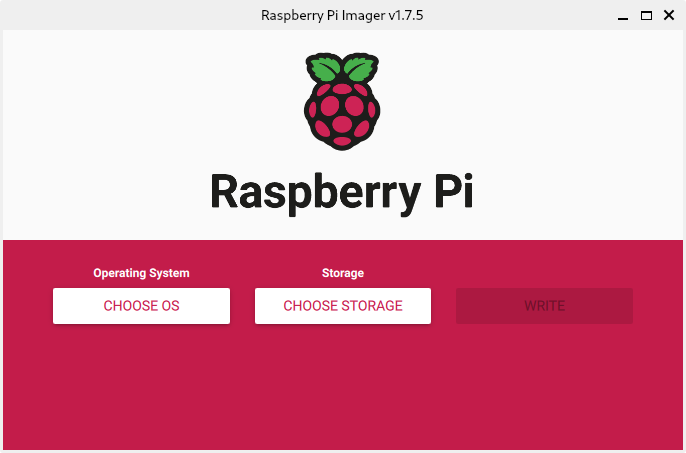
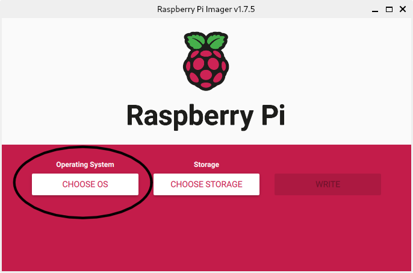
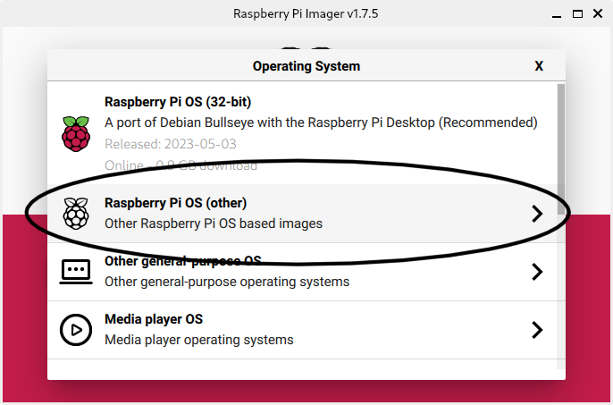
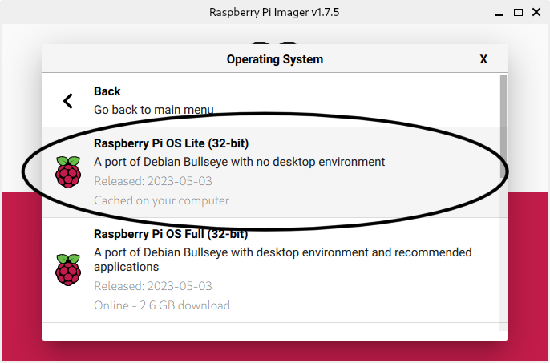
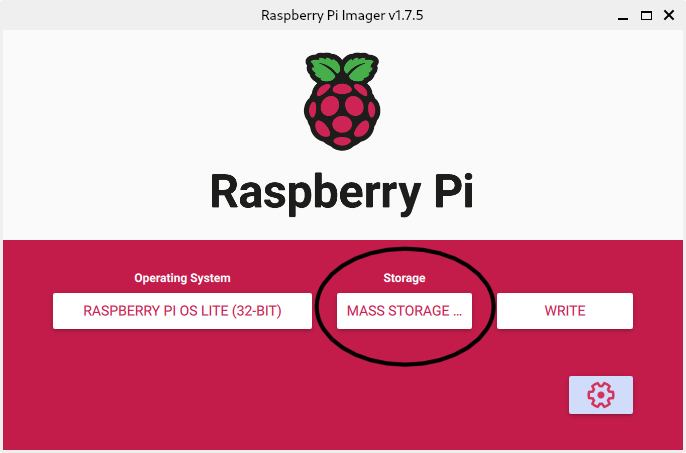
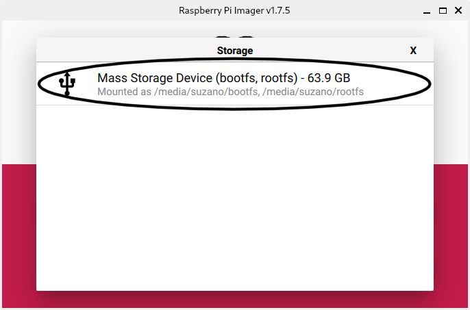
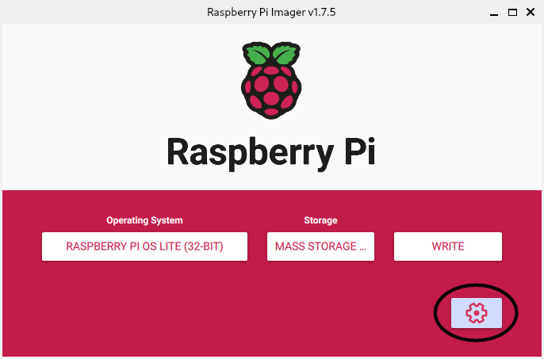
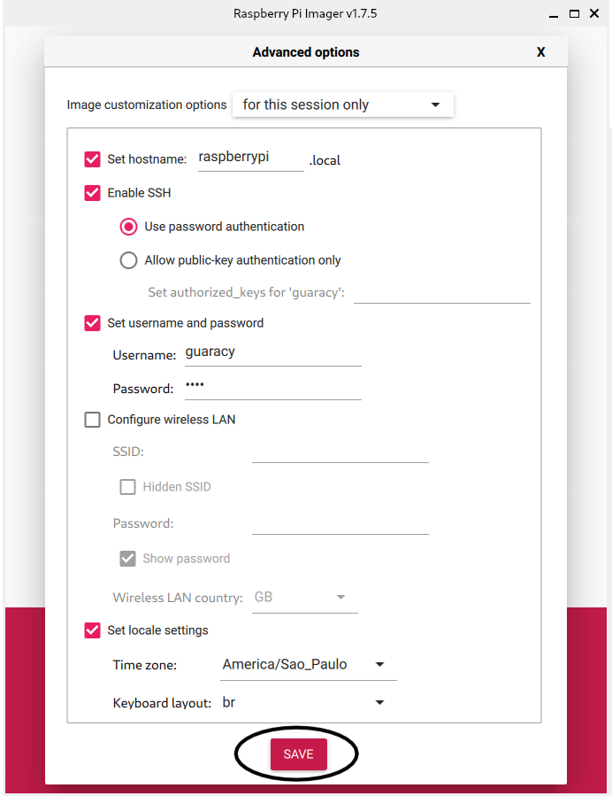
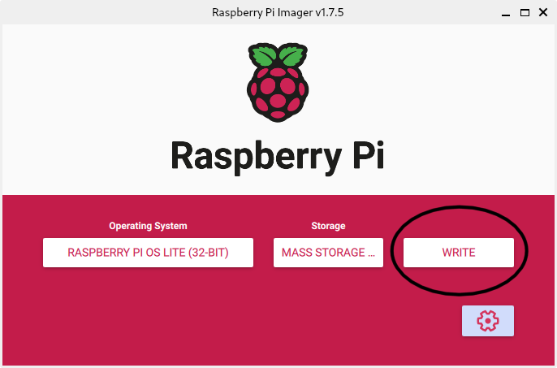

# Raspberry Pi


Este artigo oferece informações de como começar com o Raspberry Pi.

<!--more-->


Este artigo é uma anotação com recortes e traduções (vergonhosas) da página do [Raspberry Pi](https://www.raspberrypi.com).


## Conceito

O `Raspberry Pi` precisa de um sistema operacional para funcionar. Usaremos o `Raspberry Pi Imager` é a maneira rápida e fácil de instalar o `Raspberry Pi OS` e outros sistemas operacionais em um cartão microSD que será inserido no `Raspberry Pi`.

## Parte 1: Configurando seu Raspberry Pi

Para começar a usar o Raspberry Pi, é necessário os seguintes acessórios:
- Monitor de computador ou televisão. Para obter melhores resultados, deve usar um monitor com entrada HDMI®.
- Um teclado e mouse USB padrão.
- Uma fonte de alimentação de boa qualidade, projetada especificamente para fornecer consistentemente +5,1 V, apesar das rápidas flutuações no consumo de corrente.
- Cartão SD, recomenda-se um cartão micro SD de no mínimo 8 GB e usar o Raspberry Pi Imager para instalar um sistema operacional nele.

## Parte 2: Instalando o Sistema Operacional

Raspberry Pi recomenda o uso do `Raspberry Pi Imager`  para instalar um sistema operacional em seu cartão SD. Será preciso de outro computador com leitor de cartão SD para instalar a imagem. O `Raspberry Pi Imager` pode ser executado em outro Raspberry Pi, mas também funciona no Microsoft Windows, Apple macOS e Linux.

O download da versão mais recente do `Raspberry Pi Imager` pode ser feito pelo site: https://www.raspberrypi.com/software/

## Parte 3: Usando Raspberry Pi Imager

Após o download e instalação do `Raspberry Pi Imager` correspondente ao seu sistema operacional, conecte um leitor de cartão SD com o cartão SD e execute o programa.



Escolha o sistema operacional.





Escolha o cartão SD no qual deseja gravar sua imagem.





Entre no menu `Opções Avançadas` para configurar o Raspberry Pi.




Preencha os campos como mostrado acima e Salve.

E para iniciar a instalação do sistema no cartão SD.



## Parte 4: Sistema Operacional Raspberry Pi

O `Raspberry Pi OS` é um sistema operacional gratuito baseado em Debian, otimizado para o hardware `Raspberry Pi`, em desenvolvimento ativo, com ênfase na melhoria da estabilidade e do desempenho do maior número possível de pacotes Debian no Raspberry Pi, portanto, é importante manter o sistema do Raspberry Pi sempre atualizado, para correções de bugs e vulnerabilidades de segurança.

Para atualizar o software no `Raspberry Pi OS`, podemos usar a ferramenta `APT (Advanced Packaging Tool)` em uma janela do Terminal. O `APT` mantém uma lista de fontes de software no seu `Raspberry Pi` em um arquivo localizado em `/etc/apt/sources.list`.

Para atualizar a lista de pacotes abra uma janela do Terminal e digite:
```shell
$ sudo apt update
```

Atualizar todos os pacotes instalados para as versões mais recentes com o seguinte comando:
```shell
$ sudo apt full-upgrade
```

Instalar de outros pacotes com APT:
```shell
$ sudo apt install <nome_do_pacote>
```

Desinstalar um pacote com APT:
```shell
$ sudo apt remove <nome_do_pacote>
```

Remover completamente o pacote e seus arquivos de configuração associados:
```shell
$ sudo apt purge <nome_do_pacote>
```

Atualizar o kernel do Raspberry Pi OS e o firmware VideoCore para as versões:
```shell
$ sudo rpi-update
```

## Ilustrações

**PIXABAY**  
Disponível em: <https://pixabay.com/pt/photos/raspberry-pi-computador-eletr%C3%B4nicos-572481/>  
Acesso em: 25 ago. 2023.

## Referências

**RASPBERRY PI - Getting started**  
Disponível em: <https://www.raspberrypi.com/documentation/computers/getting-started.html>  
Acesso em: 25 ago. 2023.
