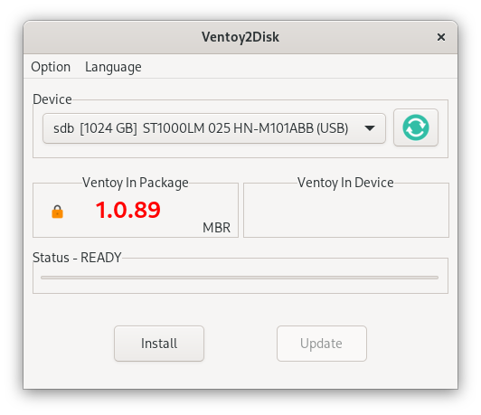

# Ventoy


Ventoy é uma ferramenta de código aberto para criar uma unidade USB inicializável para arquivos ISO/WIM/IMG/VHD(x)/EFI.

<!--more-->

## Conceitos

Com o ventoy, você não precisa formatar o disco repetidamente, basta copiar os arquivos ISO/WIM/IMG/VHD(x)/EFI para a unidade USB e inicializá-los diretamente.

Você só precisa instalar o Ventoy uma vez, depois disso basta copiar os arquivos iso para o USB.

Você pode copiar muitos arquivos de uma vez e o ventoy fornecerá um menu de inicialização para selecioná-los.
Você também pode procurar arquivos ISO/WIM/IMG/VHD(x)/EFI em discos locais e inicializá-los.

BIOS legado x86, IA32 UEFI, x86_64 UEFI, ARM64 UEFI e MIPS64EL UEFI são suportados da mesma forma.
A maioria dos tipos de SO suportados (Windows/WinPE/Linux/ChromeOS/Unix/VMware/Xen...)

## Parte 1: Ventoy

O aplicativo pode ser baixado pelo link <https://www.ventoy.net/en/download.html>.

## Parte 2: Instalação

Arch Linux
```shell
$ paru -Sy ventoy
```

## Parte 3: Como funciona...

Após a conclusão da instalação, abre o programa.



Escolha a unidade USB que deseja tornar inicializável e clique em instalar.

A unidade USB será dividida em 2 partições. Uma partição será formatada com o sistema de arquivos FAT16 e será usada SOMENTE para o `Ventoy` e a outra partição será formatada com o sistema de arquivos exFAT (você também pode reformatá-la manualmente com NTFS/FAT32/UDF/XFS/Ext2/3/4).

Agora o que você precisa fazer é copiar os arquivos `.ISO` para esta partição. Você pode colocar os arquivos iso/wim/img/vhd(x) em qualquer lugar. O Ventoy pesquisará todos os diretórios e subdiretórios recursivamente para encontrar todos os arquivos de imagem e listá-los no menu de inicialização em ordem alfabética.Além disso, você usar a configuração do plug-in para informar ao Ventoy apenas para procurar arquivos de imagem em um diretório fixo (e seus subdiretórios).

Você também pode usá-lo como uma unidade USB simples para armazenar arquivos e isso não afetará a função do Ventoy.

## Ilustrações

**MESTRE DA INFORMÁTICA**  
Disponível em: <https://mestresdainformatica.com.br/ventoy-criar-pendrive-multiboot-gratis/>  
Acesso em: 24 mar. 2023.

## Referências

**VENTOY - Site oficial**  
Disponível em: <https://www.ventoy.net/en/index.html>  
Acesso em: 24 mar. 2023.

